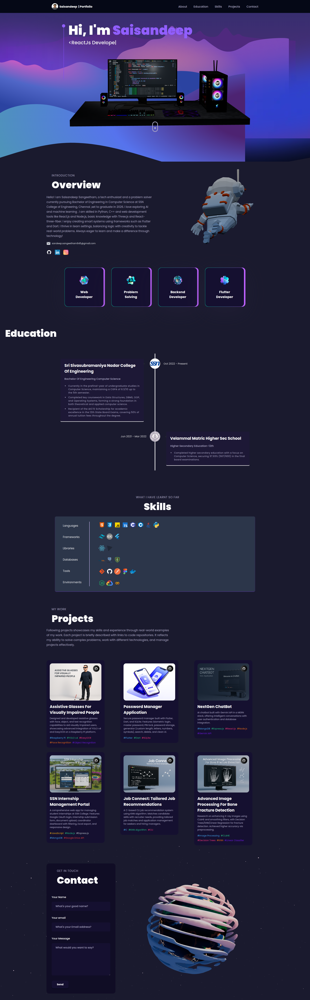

# 3D Portfolio Website

   

> A modern, responsive 3D portfolio website built with React, Three.js, and Tailwind CSS showcasing interactive 3D elements and smooth animations.

---

## 🌟 Overview

This portfolio website highlights my projects, skills, and experiences with:

- Interactive 3D elements powered by Three.js
- Responsive design that adapts to desktops, tablets, and mobile devices
- Dark mode for optimal viewing in low-light environments
- Dynamic animations created with Framer Motion
- Optimized performance via code splitting and lazy loading
- A contact form with integrated email functionality using EmailJS

---
## 📸 Full-Page Preview



---

## 🌐 Live Demo

Check out the live version here: [https://srikanth-portfolio.netlify.app/](https://srikanth-portfolio.netlify.app/)

---
## ✨ Features

- **Interactive 3D Elements**: Engaging 3D models (floating computer, interactive Earth)
- **Responsive Design**: Seamlessly adapts to all device sizes (desktop, laptop, tablet, mobile)
- **Dynamic Animations**: Smooth transitions and micro-interactions
- **Code Splitting**: Lazy-loaded components for faster initial load
- **Contact Form**: EmailJS integration with client‑side validation

---

## 🛠️ Technologies Used

**Frontend**
- React
- Three.js
- Tailwind CSS
- Framer Motion

**Development**
- Vite
- EmailJS

---

## 🗂️ Project Structure

```bash
/Portfolio
├── public/            
├── src/
│   ├── assets/        
│   ├── components/    
│   │   ├── canvas/    
│   │   └── Preloader/  
│   ├── constants/      
│   ├── styles/        
│   ├── utils/         
│   ├── App.jsx        
│   └── main.jsx       
└── index.html         
```

---

## 🚀 Setup and Installation

1. **Clone the repository**  
   ```bash
   git clone https://github.com/Saisandeepsangeetham/Portfolio.git
   cd Portfolio
   ```
2. **Install dependencies**  
   ```bash
   npm install
   ```
3. **Environment Variables**  
   Create a `.env` file in the project root and add:
   ```bash
   VITE_APP_EMAILJS_SERVICE_ID=your_service_id
   VITE_APP_EMAILJS_TEMPLATE_ID=your_template_id
   VITE_APP_EMAILJS_PUBLIC_KEY=your_public_key
   ```
4. **Run the development server**  
   ```bash
   npm run dev
   ```
5. **Build for production**  
   ```bash
   npm run build
   ```


## 📱 Responsive Design

Optimized breakpoints:
- **Desktop**: ≥1920px
- **Laptop**: 1366px–1919px
- **Tablet**: 768px–1365px
- **Mobile**: <768px

---

## ✨ Key Components

- **3D Models**: Interactive computer and floating Earth scenes
- **Dynamic Text Animation**: TypeAnimation for engaging headers
- **Preloader**: Custom animated loading screen
- **Skills Section**: Categorized skills with tooltips
- **Project Cards**: Showcase projects with live links and GitHub icons
- **Contact Form**: Validated form with EmailJS integration

---

## 🔍 Performance Optimizations

- Lazy loading for heavy Three.js components
- Code splitting via React lazy and Suspense
- Compressed and optimized 3D models and images
- Efficient state management with React hooks
- Responsive image loading with `srcSet`

---

## 📄 License

This project is licensed under the [MIT License](LICENSE).

---

## 🙏 Acknowledgements

- [Three.js](https://threejs.org/) for 3D graphics
- [Framer Motion](https://www.framer.com/motion/) for animations
- [Tailwind CSS](https://tailwindcss.com/) for utility-first styling
- [EmailJS](https://www.emailjs.com/) for email functionality
- [React Icons](https://react-icons.github.io/react-icons/) for iconography
- Various 3D model creators

---

## 📞 Contact

- **LinkedIn**: [Srikanth Senthilkumar](https://www.linkedin.com/in/srikanthatssn/)
- **GitHub**: [Srikanth-1106](https://github.com/Srikanth-1106)
- **Email**: senthilsri1106@gmail.com
- **Phone**: +91 63799 25198

© 2024 Srikanth Senthilkumar. All Rights Reserved.

